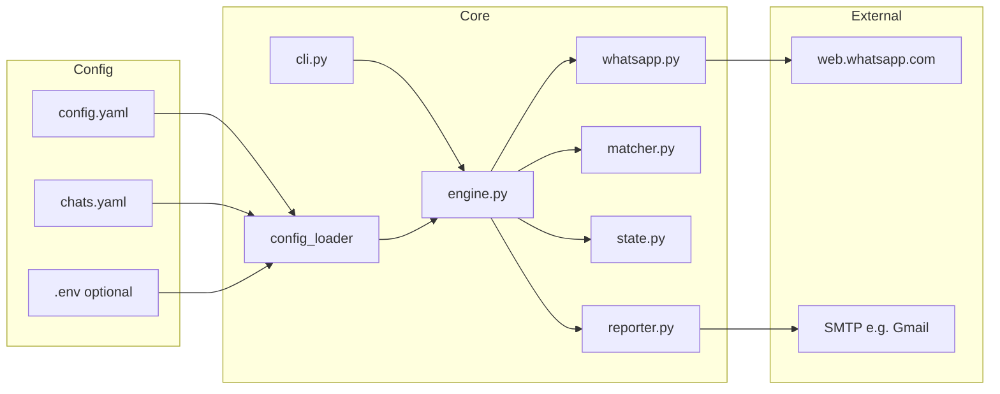

# ScoutSignal

**ScoutSignal** is a local Python CLI that drives **WhatsApp Web** with **Playwright** (persistent Chromium profile), opens only the **chats you list**, scrapes recent messages, applies **keyword / URL** filters, **dedupes** with **SQLite**, and can send **SMTP email** digests when something matches.

> **Repo layout:** this tree is intended for **GitHub** (e.g. `~/GitHub/scoutsignal`). **Secrets and WhatsApp state** belong in a **separate config directory** (e.g. `~/scoutsignal-config`) — never commit `.env`, `config.yaml` with real SMTP, or `.scoutsignal/` browser profiles.

---

## Design & architecture

### Goals

- **Privacy by scope:** only configured `chats.yaml` entries are opened; the tool does not walk your entire chat list.
- **Operational safety:** first scan can **seed** fingerprints without emailing (no “old history” blast).
- **Resilience:** WhatsApp’s DOM changes often — search and scrape logic use **multiple selectors** and **error screenshots** for debugging.
- **Internationalization:** **UTF-8** chat titles and keywords; **Unicode NFC** for matching; optional **`browser.locale`** (e.g. `he-IL`) for Hebrew UI; **`keyboard.insert_text`** for non‑Latin search queries.

### High-level flow



### Components

| Module | Role |
|--------|------|
| **`cli.py`** | Subcommands: `init`, `config-check`, `run`, `probe`; loads optional **`.env`** next to `config.yaml`. |
| **`config_loader.py`** | Merges `config.yaml` + `chats.yaml` into typed dataclasses; **`validate_config`**; **`screenshots_dir_for`**; **`browser.locale`**. |
| **`whatsapp.py`** | Persistent Chromium context; **wait for main UI**; **open chat by title** (search shortcuts + aria-labels + Hebrew buttons); **scrape** message containers; **probe** header title; **error screenshots**. |
| **`matcher.py`** | **NFC-normalized** substring match for `include_keywords` / `exclude_keywords`; optional **`require_url`**; **SHA-256** fingerprint per message. |
| **`state.py`** | SQLite: seen fingerprints + per-chat **seeded** flag. |
| **`engine.py`** | Orchestrates scan loop, seeding, hits, email digest; wraps failures with screenshots. |
| **`reporter.py`** | Plain-text MIME email over **TLS SMTP**. |

### Data model (conceptual)

- **Chat identity:** `title` substring → open via search → scrape `#main` / `[data-testid="msg-container"]`.
- **Dedupe key:** `sha256(chat_key + "\n" + raw_message_text)` stored in SQLite so the same post is not re-alerted.
- **Match rule:** message must pass **min length**, optional **URL requirement**, **no exclude keyword** hit, and **at least one include keyword** (unless `include_keywords` is empty = match all that pass filters).

---

## What we built (project history)

- **Packaging:** `pyproject.toml`, setuptools `src/` layout, CLI entry **`scoutsignal`**.
- **Bootstrap:** `scoutsignal init <dir>` copies templates and writes **`browser.user_data_dir`** + **`state.sqlite_path`** under `<dir>/.scoutsignal/`.
- **Operations:** `config-check`, `run` with **`--dry-run`**, **`--loop`**, **`--skip-email-check`**; **`probe`** prints the open chat title for accurate `chats.yaml` titles.
- **Diagnostics:** optional **`diagnostics.error_screenshots`** and directory next to `state.db`; **`extras/`** macOS **`launchd`** example plist + notes.
- **SMTP ergonomics:** **`python-dotenv`** loads **`.env`** beside `config.yaml` for **`SCOUTSIGNAL_SMTP_PASSWORD`** (never commit).
- **WhatsApp hardening:** broader **search box** detection (`aria-label="Search name or number"`, pane-side textboxes, Hebrew / English **button** fallbacks); **`insert_text`** for Hebrew/emoji titles; optional **`browser.locale`**.
- **Hebrew / UTF-8:** **NFC** normalization in **`matcher`** and **`engine`** chat keys; duplicate-title validation uses NFC; README + `config.example.yaml` document **`he-IL`**.
- **Python 3.9+** compatibility maintained in typings where relevant.

---

## What you need to run it

1. **Install:** `pip install -e .` and **`playwright install chromium`**.
2. **Config dir:** `scoutsignal init ~/scoutsignal-config` then edit **`config.yaml`** + **`chats.yaml`** (only chats you want).
3. **WhatsApp:** first **`scoutsignal run`** → scan **QR** once; profile reuse keeps login.
4. **SMTP (Gmail):** **`email.from_addr` / `to_addrs`** + Google **App Password** in **`.env`** or env var (not your normal Gmail password).
5. **Keywords:** tune **`defaults.include_keywords`** / **`exclude_keywords`**, or per-chat overrides.

### Hebrew and UTF-8

- Quote **`title:`** in YAML when names contain **`:`** or mixed punctuation.
- Set **`browser.locale: "he-IL"`** if WhatsApp Web UI is Hebrew.
- Keywords may be Hebrew, English, or both; matching is **case-insensitive** + **NFC**.

---

## Important

- Automating **WhatsApp Web** may conflict with **Meta’s terms**; use at your own risk.
- **Do not** commit **`.env`**, real **`config.yaml`**, or **`.scoutsignal/`** to public repos.
- Error **screenshots** may contain private chat pixels; disable with **`diagnostics.error_screenshots: false`** if undesired.

---

## Setup

```bash
cd scoutsignal
python3 -m venv .venv
source .venv/bin/activate   # Windows: .venv\Scripts\activate
pip install -e .
playwright install chromium
```

## Commands

```bash
scoutsignal init ~/scoutsignal-config
cd ~/scoutsignal-config
# edit config.yaml + chats.yaml; add .env with SCOUTSIGNAL_SMTP_PASSWORD if using email

scoutsignal config-check --config config.yaml --chats chats.yaml
scoutsignal probe --config config.yaml --chats chats.yaml
scoutsignal run --config config.yaml --chats chats.yaml --dry-run
scoutsignal run --config config.yaml --chats chats.yaml
scoutsignal run --config config.yaml --chats chats.yaml --loop
```

- **`seed_on_first_scan`:** first pass per chat records fingerprints **without** email to avoid flooding old messages.

## Publishing to GitHub

From this folder (after creating an empty repo on GitHub):

```bash
cd ~/GitHub/scoutsignal
git remote add origin https://github.com/<you>/<repo>.git
git push -u origin main
```

Use a **`.gitignore`** that excludes local config copies if you ever keep them inside the clone (this repo already ignores **`.env`**, **`.venv/`**, **`.scoutsignal/`**, **`*.db`**).

## Files

| File | Purpose |
|------|---------|
| `config.yaml` | Browser profile, `locale`, intervals, keywords, SMTP, diagnostics |
| `chats.yaml` | Which chats to watch; optional per-chat keyword overrides |

Templates: **`config.example.yaml`**, **`chats.example.yaml`**.

## License

Add a `LICENSE` file of your choice when you publish (not included by default).
